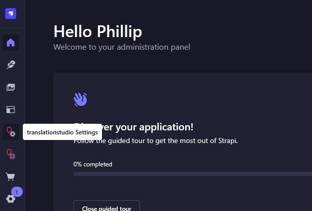
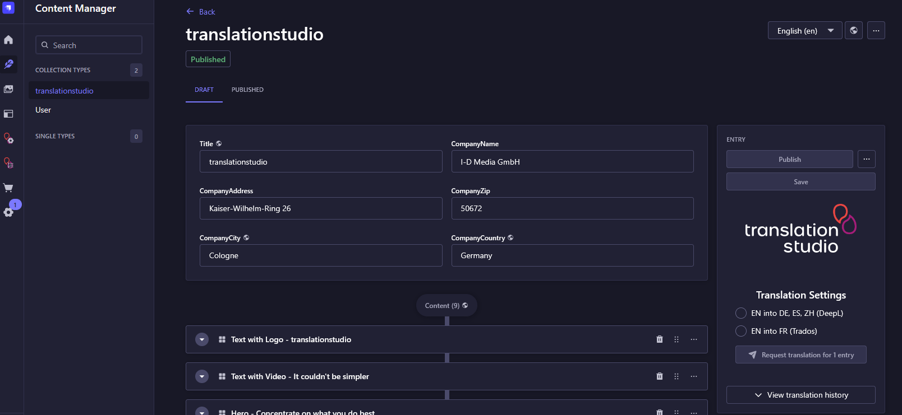
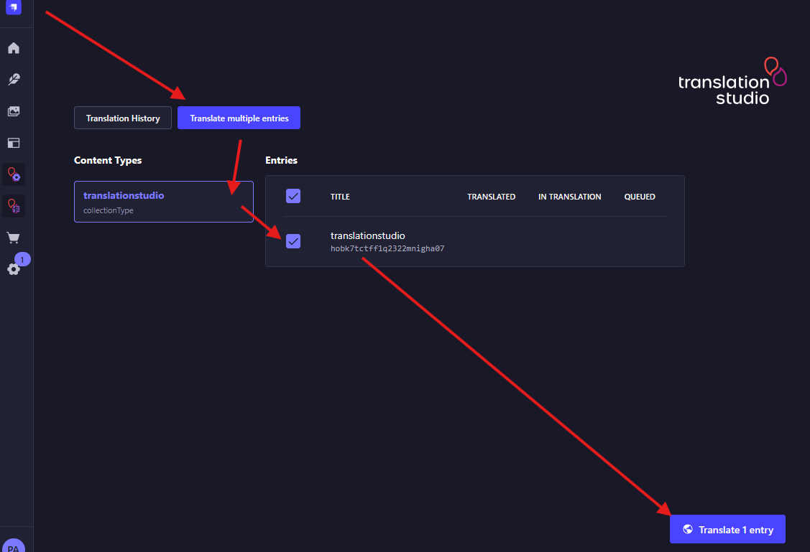
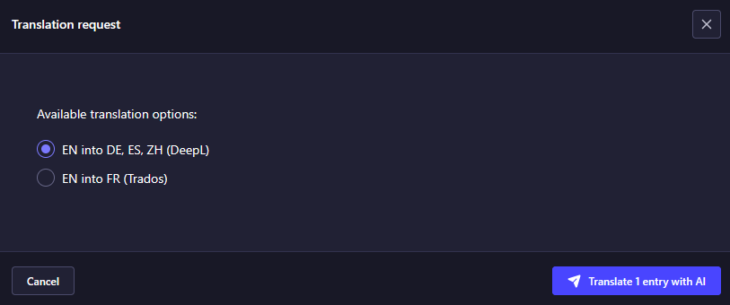
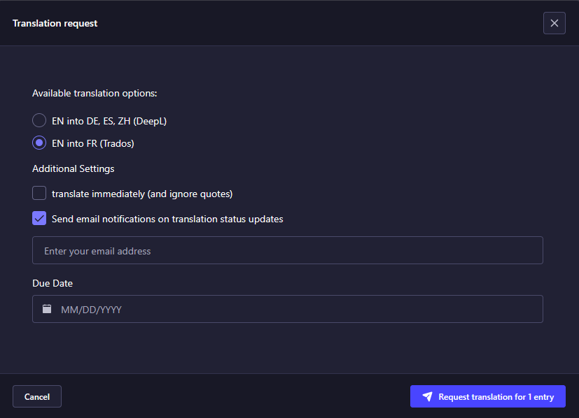

# translationstudio Strapi Extension

translationstudio brings enterprise translation management automation to Strapi. Use translationstudio to send translations to your favourite translation provider, either machine translation services or translation agencies.

> [!NOTE]  
> You will need a translationstudio subscription to use this plugin. Different plans, including a free plan, are available at https://translationstudio.tech

## Features

- ✅ Full automation to increase efficiency and time to market
- ✅ Easy to use interface
- ✅ Dashboard to stay up to date with recent translation processes
- ✅ Connect to industry standard translation service providers 
- ✅ Choose between immediate or quote-based translation requests for translation management

...and much more

## Installation

Install this plugin to Strapi via 

```bash
npm i @translationstudio/translationstudio-strapi-extension
```

Once installed, you will see two new icons in your administration panel:



## Configuration 

Once the plugin is installed, navigate to `translationstudio settings`  in Strapi's admin panel.

### Setting up translation options

1. Generate your access token and save it for later use
2. Access your account.translationstudio.tech Strapi configuration and set the URL for translationstudio to reach your Strapi instance
3. Assign your access token. This will authorize translationstudio to "talk" to Strapi.
4. Verify the connection and fetch available languages 
5. Create a license and save it for later use.
6. Click on save

> [!TIP]
> If you have not yet configured your translation service providers, now is the tine.

Finally, create translation options for your editors and save your changes again.

### Finalizing your Strapi configuration

On the `translationstudio settings` page, paste your translationstudio license created earlier and click on save.


> [!TIP]
> translationstudio is ready to use.

## Using translationstudio

### Translate an entry

When editing an entry, a translationstudio panel will be available at the right. Choose your translation options and initiate a translation request after you have completed editing.



### Dashboard

You can access your translationstudio dashboard to 

1. Access your translation history
2. Translate multiple entries

To translate multiple entries, select `Translate multiple entries`, choose your content type and select the entries you wish to translate. The `translate` button at the lower right opens a translation request popup for you to choose your action.

#### 1. Choose entries to be translated


#### 2. Choose your options






## Development

Follow these steps:

1. run `npm install -g yalc` in this folder
2. run `npm install` (if there are errors, add `--legacy-peer-deps`)
3. run `npm run watch:link` in this folder
4. Create a new strapi project and enter the folder
5. run `npx yalc add --link @translationstudio/translationstudio-strapi-extension`
6. start strapi in development mode

### Publish package update

1. Update version number
2. run `npm run build`
3. run `npm publish --access public`

## Resources

* [translationstudio.tech](https://translationstudio.tech)
* [account.translationstudio.tech](https://account.translationstudio.tech)
* [idmedia.com](https://idmedia.com)

## License

See the [LICENSE](LICENSE) file for licensing information
